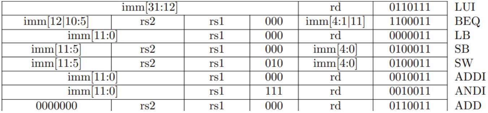

## 本次小实验需要的指令

```asm
LUI   iiiiiiiiiiiiiiiiiiiiddddd0110111
BEQ   iiiiiiiSSSSSsssss000iiiii1100011
LB    iiiiiiiiiiiisssss000ddddd0000011
SB    iiiiiiiSSSSSsssss000iiiii0100011
SW    iiiiiiiSSSSSsssss010iiiii0100011
ADDI  iiiiiiiiiiiisssss000ddddd0010011
ANDI  iiiiiiiiiiiisssss111ddddd0010011
ADD   0000000SSSSSsssss000ddddd0110011
```



## 基本结构图


## 基础版本的 Kernel 需要的指令

基础版本的 Kernel 共使用了 19 条不同的指令，它们是：

```asm
ADD   0000000SSSSSsssss000ddddd0110011
ADDI  iiiiiiiiiiiisssss000ddddd0010011
AND   0000000SSSSSsssss111ddddd0110011
ANDI  iiiiiiiiiiiisssss111ddddd0010011
AUIPC iiiiiiiiiiiiiiiiiiiiddddd0010111
BEQ   iiiiiiiSSSSSsssss000iiiii1100011
BNE   iiiiiiiSSSSSsssss001iiiii1100011
JAL   iiiiiiiiiiiiiiiiiiiiddddd1101111
JALR  iiiiiiiiiiiisssss000ddddd1100111
LB    iiiiiiiiiiiisssss000ddddd0000011
LUI   iiiiiiiiiiiiiiiiiiiiddddd0110111
LW    iiiiiiiiiiiisssss010ddddd0000011
OR    0000000SSSSSsssss110ddddd0110011
ORI   iiiiiiiiiiiisssss110ddddd0010011
SB    iiiiiiiSSSSSsssss000iiiii0100011
SLLI  0000000iiiiisssss001ddddd0010011
SRLI  0000000iiiiisssss101ddddd0010011
SW    iiiiiiiSSSSSsssss010iiiii0100011
XOR   0000000SSSSSsssss100ddddd0110011
```

分类以后：

```
ADD: ADDI, AND, ANDI, OR, ORI, SLLI, SRLI, XOR, ADDIW
AUIPC:
BEQ: BNE
JAL:
JALR:
LB: LW, LD
LUI:
SB: SW, SD
```